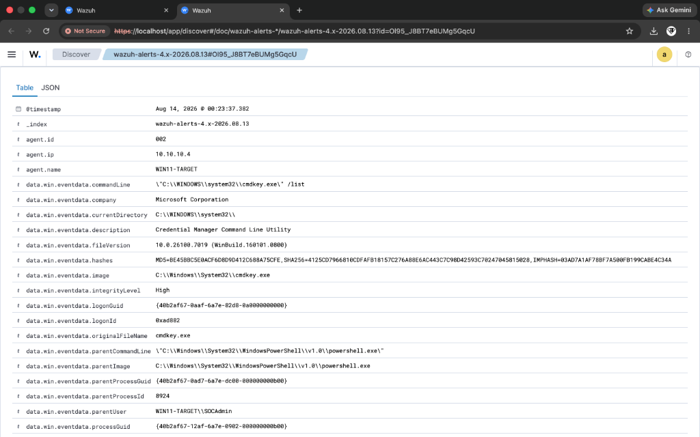
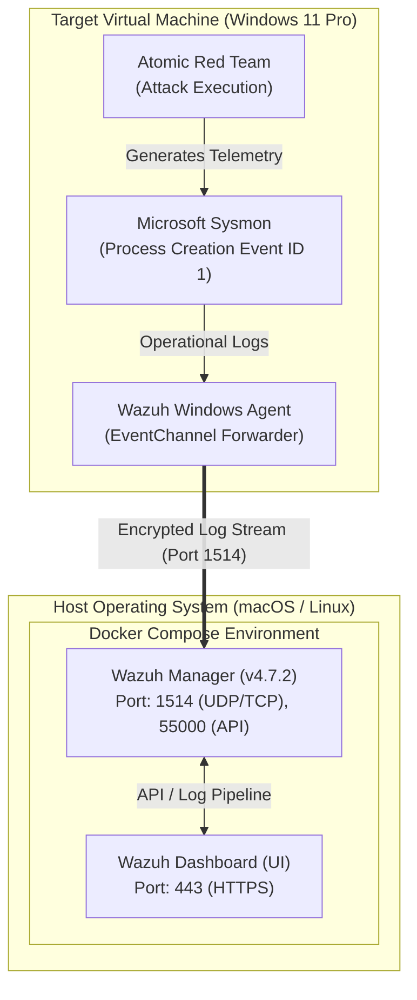
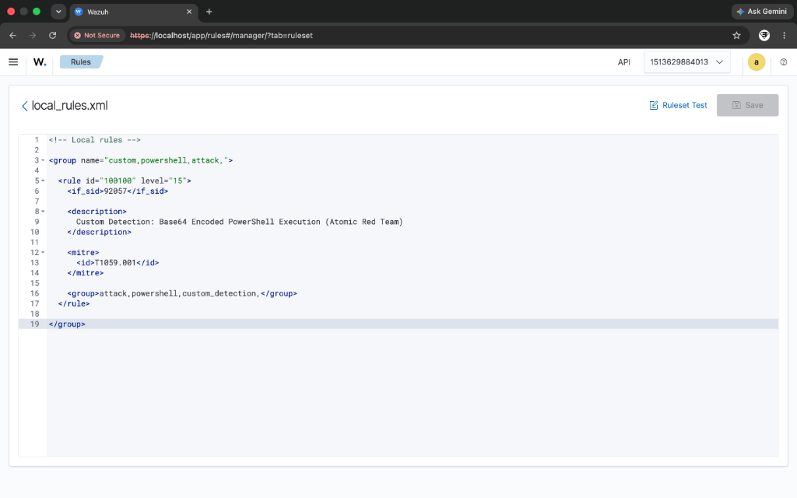
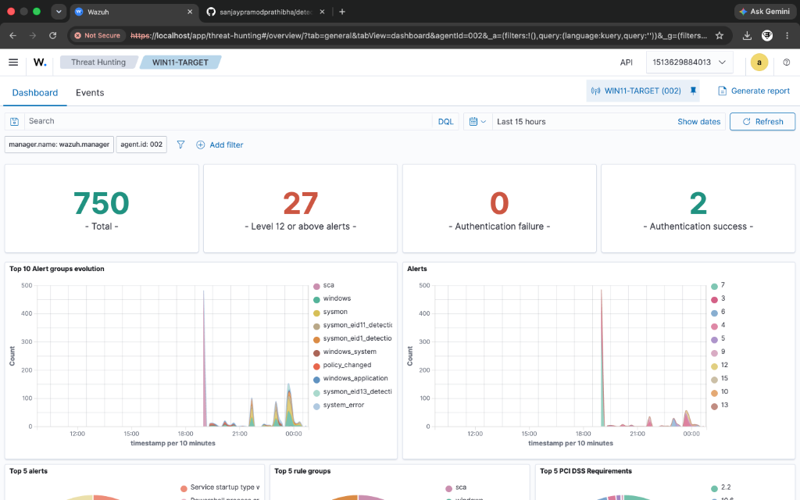

# 🛡️ Detection Engineering & Threat Hunting Lab (Wazuh + Sysmon + MITRE ATT&CK)

[](https://github.com/sanjaypramodprathibha/detection-engineering-lab/releases)
[](https://wazuh.com)
[](https://learn.microsoft.com/en-us/sysinternals/downloads/sysmon)
[](https://attack.mitre.org)

> A hands-on SOC detection engineering lab built to simulate real-world cyber attack techniques, analyze endpoint telemetry via Sysmon, author custom Wazuh SIEM detection rules, and perform structured incident response.

---

## 📸 Executive Dashboard & Telemetry Overview


*Figure 1.1: Main Wazuh SIEM Security Events Overview Dashboard showing active agent monitoring and alert telemetry.*

---

## 🏗️ Architecture & Infrastructure Design



### Infrastructure Specs
- **SIEM Manager**: Wazuh Manager (Self-Hosted via Docker Compose on Host OS)
- **Monitored Endpoint**: Windows 11 Pro Virtual Machine (VirtualBox NAT Network)
- **Telemetry Engine**: Microsoft Sysmon (`Microsoft-Windows-Sysmon/Operational`)
- **Attack Automation**: Red Canary Atomic Red Team

---

## 📊 MITRE ATT&CK Detection Matrix

Below is the summary of the core attack scenarios executed, detected, and verified with custom Wazuh XML rules:

| # | Technique Name | MITRE ID | Tactic | Parent Rule | Custom Rule ID | Severity | Status |
|---|---|---|---|---|---|---|---|
| **1** | Base64 Encoded PowerShell | `T1059.001` | Execution | `92057` | **`100100`** *(Correlated)*<br>**`100105`** *(Standalone)* | Level 15 (Critical) | ✅ Verified |
| **2** | Scheduled Task Creation | `T1053.005` | Persistence | `92032` | **`100101`** | Level 12 (High) | ✅ Verified |
| **3** | Registry Run Key Persistence | `T1547.001` | Persistence | `92302` | **`100102`** | Level 12 (High) | ✅ Verified |
| **4** | Clear Windows Event Logs | `T1070.001` | Defense Evasion | `windows` | **`100103`** | Level 13 (High) | ✅ Verified |
| **5** | Credential Store Enumeration | `T1555.004` | Credential Access | `windows` | **`100104`** | Level 14 (High) | ✅ Verified |

---

## ⏱️ Lab Reproduction & Setup Time Estimates

The complete lab environment can be deployed from scratch in **under 45 minutes**:

| Phase | Task | Tools Required | Estimated Time |
|---|---|---|---|
| **Phase 1** | Install Docker & Docker Compose | Docker Desktop / CLI | 10 mins |
| **Phase 2** | Deploy Wazuh SIEM Stack | `docker-compose up -d` | 15 mins |
| **Phase 3** | Install Sysmon on Windows 11 | Sysinternals Sysmon | 5 mins |
| **Phase 4** | Install & Register Wazuh Agent | Wazuh Agent Installer | 5 mins |
| **Phase 5** | Install Atomic Red Team & Execute | Invoke-AtomicRedTeam | 10 mins |
| **TOTAL** | **Complete Lab Deployment** | - | **~45 mins** |

---

## 🚀 Step-by-Step Deployment Guide

### 1. Deploy Wazuh SIEM via Docker Compose
Clone the repository and spin up the single-node Wazuh deployment:
```bash
git clone https://github.com/sanjaypramodprathibha/detection-engineering-lab.git
cd detection-engineering-lab/docker
docker-compose up -d
```
Verify containers are running:
```bash
docker ps
```
Access the dashboard at `https://localhost` (Default login: `admin` / `admin`).

### 2. Configure Sysmon on Windows 11 VM
1. Download Sysmon and install with SwiftOnSecurity config:
   ```cmd
   sysmon64.exe -i sysmonconfig-export.xml -accepteula
   ```
2. Edit `C:\Program Files (x86)\ossec-agent\ossec.conf` and bind the Sysmon eventchannel:
   ```xml
   <localfile>
     <location>Microsoft-Windows-Sysmon/Operational</location>
     <log_format>eventchannel</log_format>
   </localfile>
   ```
3. Restart Wazuh Agent:
   ```powershell
   Restart-Service -Name Wazuh
   ```

### 3. Deploy Custom Rules
Paste the contents of [`custom_rules/local_rules.xml`](custom_rules/local_rules.xml) into `/var/ossec/etc/rules/local_rules.xml` on your Wazuh Manager or directly in the Web UI (**Server Management -> Rules**):


*Figure 3.1: Custom rule engineering inside the Wazuh Web UI rule editor.*

Click **Save** and **Restart Manager**.

### 4. Threat Hunting & Alert Verification


*Figure 4.1: Threat Hunting dashboard displaying custom rules firing for executed attack techniques.*

---

## 🛠️ Custom Rule Engineering (Correlation vs Standalone)

This project demonstrates two complementary methodologies for writing SIEM detection rules:

1. **Rule Correlation (`<if_sid>`)**: Extending existing parent alerts (e.g. Rule `100100` inherits from parent rule `92057` to elevate severity and append MITRE metadata).
2. **Standalone Direct Field Detection (`<field name="...">`)**: Inspecting raw Sysmon process creation fields independently without relying on parent rules (e.g. Rule `100105` parses command line regex `(?i)powershell.*(\s+-e\s+|\s+-encodedcommand\s+)` directly).

---

## 📑 Detailed Incident Response Reports

Detailed incident analysis reports for each technique are available in [`incident_reports/`](incident_reports/):
- 📄 [**IR-001: PowerShell Obfuscation (T1059.001)**](incident_reports/IR-001_T1059.001_PowerShell_Obfuscation.md)
- 📄 [**IR-002: Scheduled Task Persistence (T1053.005)**](incident_reports/IR-002_T1053.005_Scheduled_Task_Persistence.md)
- 📄 [**IR-003: Registry Run Key Persistence (T1547.001)**](incident_reports/IR-003_T1547.001_Registry_Run_Keys.md)
- 📄 [**IR-004: Clear Windows Event Logs (T1070.001)**](incident_reports/IR-004_T1070.001_Clear_Windows_Event_Logs.md)
- 📄 [**IR-005: Credential Store Enumeration (T1555.004)**](incident_reports/IR-005_T1555.004_Credential_Store_Enumeration.md)

---

## 📦 Repository Structure

```text
.
├── README.md                          # Master documentation & lab guide
├── docker/
│   └── docker-compose.yml             # Single-node Wazuh Docker Compose deployment
├── custom_rules/
│   └── local_rules.xml                # Custom Wazuh ruleset (Rules 100100 - 100105)
├── incident_reports/                  # Individual incident triage reports
│   ├── IR-001_T1059.001_PowerShell_Obfuscation.md
│   ├── IR-002_T1053.005_Scheduled_Task_Persistence.md
│   ├── IR-003_T1547.001_Registry_Run_Keys.md
│   ├── IR-004_T1070.001_Clear_Windows_Event_Logs.md
│   └── IR-005_T1555.004_Credential_Store_Enumeration.md
├── queries/
│   └── threat_hunting.md              # DQL threat hunting cheat sheet
├── configs/                           # Sysmon & Wazuh configuration snippets
│   ├── sysmon_config_note.md
│   └── wazuh_agent_ossec_snippet.xml
└── screenshots/                       # Visual assets & alert screenshots
    └── README.md
```

---

## 🏷️ Version History & Release Notes

### `v1.0.0` - Initial Production Release
- Added 5 core MITRE ATT&CK technique simulations and detections.
- Deployed single-node Docker Compose Wazuh stack.
- Implemented dual-mode custom detection rules (Parent correlation + Standalone regex).
- Authored 5 structured incident response reports with containment playbooks.
- Added visual asset guide, setup time metrics, and Mermaid architecture diagram.

---

## 📜 License & Acknowledgments

This project is built for educational, portfolio, and defensive research purposes. Special thanks to the open-source community:
- [Wazuh SIEM](https://wazuh.com)
- [Microsoft Sysinternals Sysmon](https://learn.microsoft.com/en-us/sysinternals/downloads/sysmon)
- [Red Canary Atomic Red Team](https://github.com/redcanaryco/invoke-atomicredteam)
