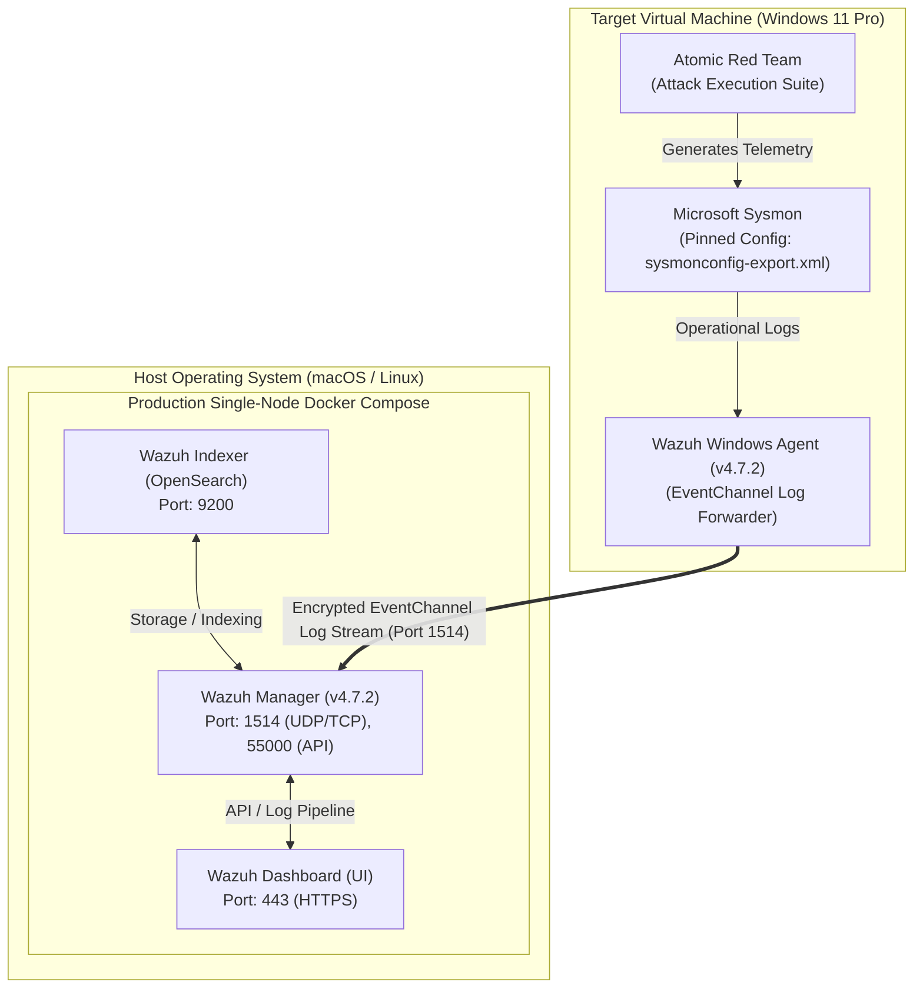

# 🛡️ Detection Engineering & Threat Hunting Lab (Wazuh + Sysmon + MITRE ATT&CK)

[](https://github.com/sanjaypramodprathibha/detection-engineering-lab/releases)
[](LICENSE)
[](.github/workflows/ci.yml)
[](https://wazuh.com)
[](configs/sysmonconfig-export.xml)
[](https://attack.mitre.org)

> A production-grade SOC detection engineering lab built to simulate real-world cyber attack techniques, capture endpoint telemetry via Sysmon, author custom Wazuh SIEM detection rules (parent correlation & standalone field matching), and perform structured incident response.

---

## 📸 Executive Dashboard & Telemetry Overview


*Figure 1.1: Main Wazuh SIEM Security Events Overview Dashboard showing active agent monitoring and alert telemetry.*

---

## 🏗️ Architecture & Infrastructure Design



### Infrastructure Specs
- **SIEM Manager**: Wazuh Manager (Self-Hosted via Production Docker Compose Stack)
- **Log Search & Indexing**: Wazuh Indexer (OpenSearch)
- **Monitored Endpoint**: Windows 11 Pro Virtual Machine (VirtualBox NAT Network)
- **Telemetry Engine**: Microsoft Sysmon ([`configs/sysmonconfig-export.xml`](configs/sysmonconfig-export.xml))
- **Attack Automation**: Red Canary Atomic Red Team ([`configs/atomic_red_team_guide.md`](configs/atomic_red_team_guide.md))

---

## 📊 MITRE ATT&CK Detection Matrix

Below is the summary of the core attack scenarios executed, detected, and verified with custom Wazuh XML rules:

| # | Technique Name | MITRE ID | Tactic | Parent Rule | Custom Rule ID | Rule Engineering Type | Severity | Status |
|---|---|---|---|---|---|---|---|---|
| **1** | Base64 Encoded PowerShell | `T1059.001` | Execution | `92057` | **`100100`**<br>**`100105`** | Parent Correlation / Escalation<br>Standalone Sysmon Field Match | Level 15 (Critical) | ✅ Verified |
| **2** | Scheduled Task Creation | `T1053.005` | Persistence | `92032` | **`100101`** | Standalone Sysmon Field Match | Level 12 (High) | ✅ Verified |
| **3** | Registry Run Key Persistence | `T1547.001` | Persistence | `92302` | **`100102`** | Parent Correlation / Escalation | Level 12 (High) | ✅ Verified |
| **4** | Clear Windows Event Logs | `T1070.001` | Defense Evasion | Sysmon EID 1 | **`100103`** | Standalone Sysmon Field Match | Level 13 (High) | ✅ Verified |
| **5** | Credential Store Enumeration | `T1555.004` | Credential Access | Sysmon EID 1 | **`100104`** | Standalone Sysmon Field Match | Level 14 (High) | ✅ Verified |

---

## ⏱️ Lab Reproduction & Setup Time Estimates

The complete production SIEM environment can be deployed from scratch in **under 45 minutes**:

| Phase | Task | Tools Required | Estimated Time |
|---|---|---|---|
| **Phase 1** | Install Docker & Docker Compose | Docker Desktop / CLI | 10 mins |
| **Phase 2** | Deploy Full Wazuh Stack (Manager + Indexer + Dashboard) | `docker compose -f docker/docker-compose.yml up -d` | 15 mins |
| **Phase 3** | Install Sysmon with Pinned Config | Sysinternals Sysmon + `sysmonconfig-export.xml` | 5 mins |
| **Phase 4** | Install & Register Wazuh Agent | Wazuh Agent Installer + `ossec.conf` binding | 5 mins |
| **Phase 5** | Install Atomic Red Team & Execute Attacks | Invoke-AtomicRedTeam | 10 mins |
| **TOTAL** | **Complete Lab Deployment** | - | **~45 mins** |

---

## 🚀 Step-by-Step Deployment Guide

### 1. Deploy Production Single-Node Wazuh Stack
Clone the repository and spin up the complete single-node deployment (Wazuh Indexer + Manager + Dashboard):
```bash
git clone https://github.com/sanjaypramodprathibha/detection-engineering-lab.git
cd detection-engineering-lab/docker
docker compose up -d
```
Verify containers are running:
```bash
docker compose ps
```
Access the dashboard at `https://localhost` (Default HTTPS port 443).

### 2. Configure Sysmon on Windows 11 VM
1. Download Sysmon and install using the pinned repository baseline:
   ```cmd
   sysmon64.exe -i configs/sysmonconfig-export.xml -accepteula
   ```
2. Edit `C:\Program Files (x86)\ossec-agent\ossec.conf` and paste the `<localfile>` block inside the main `<ossec_config>` element:
   ```xml
   <localfile>
     <location>Microsoft-Windows-Sysmon/Operational</location>
     <log_format>eventchannel</log_format>
   </localfile>
   ```
3. Restart the Wazuh Agent service via PowerShell (Admin):
   ```powershell
   Restart-Service -Name Wazuh
   ```

### 3. Deploy Custom Rules
Paste the contents of [`custom_rules/local_rules.xml`](custom_rules/local_rules.xml) into `/var/ossec/etc/rules/local_rules.xml` on your Wazuh Manager or directly in the Web UI (**Server Management -> Rules**):


*Figure 3.1: Custom rule engineering inside the Wazuh Web UI rule editor.*

Click **Save** and **Restart Manager**.

### 4. Threat Hunting & Alert Verification


*Figure 4.1: Threat Hunting dashboard displaying custom rules firing for executed attack techniques.*

---

## 🛠️ Custom Rule Engineering (Correlation vs Standalone)

This project demonstrates two distinct methodologies for writing SIEM detection rules:

1. **Parent Correlation & Severity Escalation (`<if_sid>`)**:
   - *Rules 100100 & 100102*: These rules hook into existing parent alerts (e.g. default rule `92057` for PowerShell and `92302` for Registry Run key changes). They do not alter the match criteria; instead, they enrich the alert by escalating severity (to Level 12–15), applying MITRE ATT&CK taxonomy metadata, and routing to custom alert groups.
2. **Standalone Direct Sysmon Field Matching (`<field name="...">`)**:
   - *Rules 100101, 100103, 100104, & 100105*: These rules inspect raw Sysmon Process Creation (Event ID 1) telemetry directly. They enforce strict field matching on `win.system.providerName`, `win.system.eventID`, `win.eventdata.image`, and PCRE2 regex on `win.eventdata.commandLine` without depending on parent rules.

---

## ⚙️ Automated Testing & CI/CD Pipeline

This repository includes automated validation via [GitHub Actions](.github/workflows/ci.yml) and test sample fixtures in [`tests/logtest_samples.json`](tests/logtest_samples.json):
- **XML Syntax Validation**: `xmllint` check on `local_rules.xml` and `sysmonconfig-export.xml`.
- **Compose Stack Validation**: `docker compose config` validation.
- **Logtest Verification**: Test cases validating event matches for true/false-positive samples.

---

## 📑 Detailed Incident Response Reports

Detailed incident analysis reports for each technique are available in [`incident_reports/`](incident_reports/):
- 📄 [**IR-001: PowerShell Obfuscation (T1059.001)**](incident_reports/IR-001_T1059.001_PowerShell_Obfuscation.md)
- 📄 [**IR-002: Scheduled Task Persistence (T1053.005)**](incident_reports/IR-002_T1053.005_Scheduled_Task_Persistence.md)
- 📄 [**IR-003: Registry Run Key Persistence (T1547.001)**](incident_reports/IR-003_T1547.001_Registry_Run_Keys.md)
- 📄 [**IR-004: Clear Windows Event Logs (T1070.001)**](incident_reports/IR-004_T1070.001_Clear_Windows_Event_Logs.md)
- 📄 [**IR-005: Credential Store Enumeration (T1555.004)**](incident_reports/IR-005_T1555.004_Credential_Store_Enumeration.md)

---

## 📦 Repository Structure

```text
.
├── README.md                          # Master documentation & lab guide
├── LICENSE                            # MIT License
├── .github/
│   └── workflows/
│       └── ci.yml                     # GitHub Actions CI validation pipeline
├── docker/
│   └── docker-compose.yml             # Production single-node Wazuh stack (Manager+Indexer+Dashboard)
├── custom_rules/
│   └── local_rules.xml                # Custom Wazuh ruleset (Rules 100100 - 100105)
├── incident_reports/                  # Individual incident triage reports
│   ├── IR-001_T1059.001_PowerShell_Obfuscation.md
│   ├── IR-002_T1053.005_Scheduled_Task_Persistence.md
│   ├── IR-003_T1547.001_Registry_Run_Keys.md
│   ├── IR-004_T1070.001_Clear_Windows_Event_Logs.md
│   └── IR-005_T1555.004_Credential_Store_Enumeration.md
├── queries/
│   └── threat_hunting.md              # DQL threat hunting cheat sheet
├── configs/                           # Sysmon & Wazuh configuration files
│   ├── sysmonconfig-export.xml        # Pinned Sysmon configuration XML
│   ├── sysmon_config_note.md          # Sysmon event logging specifications
│   ├── wazuh_agent_ossec_snippet.xml  # ossec.conf Sysmon eventchannel snippet
│   └── atomic_red_team_guide.md       # Durable Atomic Red Team execution guide
├── tests/
│   └── logtest_samples.json           # Rule testing event sample fixtures
└── screenshots/                       # Visual assets & screenshot inventory
    └── README.md
```

---

## 🏷️ Version History & Release Notes

### `v1.1.0` - Production-Grade Engineering Enhancement
- **Docker Stack**: Upgraded Compose definition to full production single-node stack (Wazuh Indexer + Manager + Dashboard).
- **Rule Tightening**: Scoped standalone custom rules to Sysmon Event ID 1 and exact `win.eventdata.image` paths.
- **Rule Taxonomy**: Accurately labeled parent correlation rules (`100100`, `100102`) vs standalone rules (`100101`, `100103`, `100104`, `100105`).
- **Telemetry Pinning**: Added pinned `sysmonconfig-export.xml` and durable `atomic_red_team_guide.md`.
- **CI/CD Pipeline**: Added GitHub Actions workflow (`ci.yml`) and `logtest_samples.json` test fixtures.
- **Licensing**: Added MIT License file.

---

## 📜 License & Acknowledgments

This project is released under the [MIT License](LICENSE). Special thanks to the open-source community:
- [Wazuh SIEM](https://wazuh.com)
- [Microsoft Sysinternals Sysmon](https://learn.microsoft.com/en-us/sysinternals/downloads/sysmon)
- [Red Canary Atomic Red Team](https://github.com/redcanaryco/invoke-atomicredteam)
