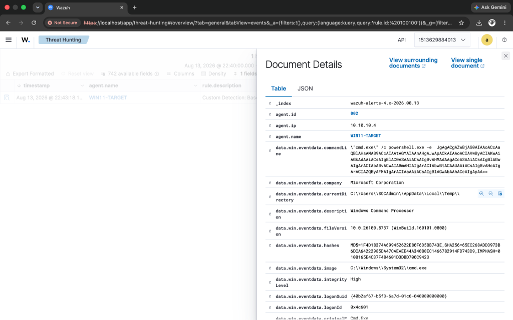
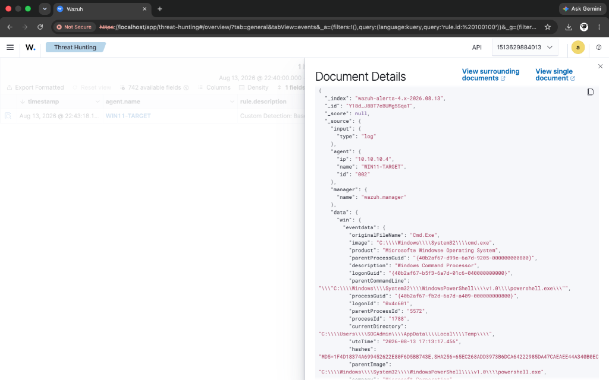

# Incident Report: IR-001
## Technique: PowerShell Base64 Obfuscation (T1059.001)

### Executive Summary
A high-severity alert was generated on endpoint `WIN11-TARGET` indicating the execution of a PowerShell command containing encoded (Base64) instructions. Base64 encoding is frequently leveraged by threat actors to evade perimeter content filters and hide malicious payloads during initial execution.

---

### 📷 Visual Evidence & Alert Verification


*Figure 1.1: Document details for Rule 100100 capturing obfuscated Base64 PowerShell execution.*


*Figure 1.2: Raw JSON log structure forwarding process creation parameters into Wazuh SIEM.*

---

### Incident Overview
- **Incident ID**: IR-001
- **Severity**: High (Level 15)
- **Target Host**: `WIN11-TARGET` (IP: `10.10.10.4`)
- **Detection Engine**: Wazuh SIEM + Sysmon Integration
- **Custom Rule ID**: `100100` (Parent Correlated) & `100105` (Standalone Sysmon)
- **MITRE ATT&CK Mapping**: Execution / Command and Scripting Interpreter: PowerShell (`T1059.001`)

---

### Threat Details & Execution Vector

#### Attack Command
```powershell
powershell.exe -e <base64_encoded_command>
```

#### Simulated Behavior
The attack simulated an obfuscated PowerShell payload execution via Atomic Red Team (Test #17). The `-e` / `-EncodedCommand` parameter allows binary scripts to execute without plain-text visibility in raw command prompts.

---

### Telemetry & Log Evidence

- **Log Source**: `Microsoft-Windows-Sysmon/Operational`
- **Sysmon Event ID**: `1` (Process Creation)
- **Parent Process**: `cmd.exe`
- **Child Process**: `powershell.exe`
- **Raw Command Line**: `powershell.exe -e <base64_encoded_payload>`
- **User Context**: `WIN11-TARGET\SOCAdmin`
- **Integrity Level**: High

---

### Detection Logic & Rule Configuration

```xml
<!-- Correlated Parent Variant -->
<rule id="100100" level="15">
  <if_sid>92057</if_sid>
  <description>Custom Detection: Base64 Encoded PowerShell Execution (Atomic Red Team - T1059.001)</description>
  <mitre>
    <id>T1059.001</id>
  </mitre>
  <group>attack,powershell,custom_detection,</group>
</rule>

<!-- Standalone Direct Field Matching Variant -->
<rule id="100105" level="15">
  <if_group>windows</if_group>
  <field name="win.eventdata.commandLine" type="pcre2">(?i)powershell.*(\s+-e\s+|\s+-encodedcommand\s+|\s+-enc\s+)</field>
  <description>Custom Detection: Direct Encoded PowerShell Command Line Execution (Standalone Rule - T1059.001)</description>
  <mitre>
    <id>T1059.001</id>
  </mitre>
  <group>attack,powershell,custom_detection,standalone,</group>
</rule>
```

---

### Response & Containment Recommendations

1. **Host Isolation**: Isolate `WIN11-TARGET` from the network if unapproved script execution is confirmed.
2. **Decode Payload**: Extract and base64-decode the command string to inspect script intent (e.g. reverse shell, C2 download, script block logging analysis).
3. **Check ScriptBlock Logs**: Audit Windows PowerShell Event ID 4104 (ScriptBlock Logging) to inspect decoded code executed in memory.
4. **Constrained Language Mode**: Enforce PowerShell Constrained Language Mode via AppLocker/WDAC policies for non-admin accounts.
