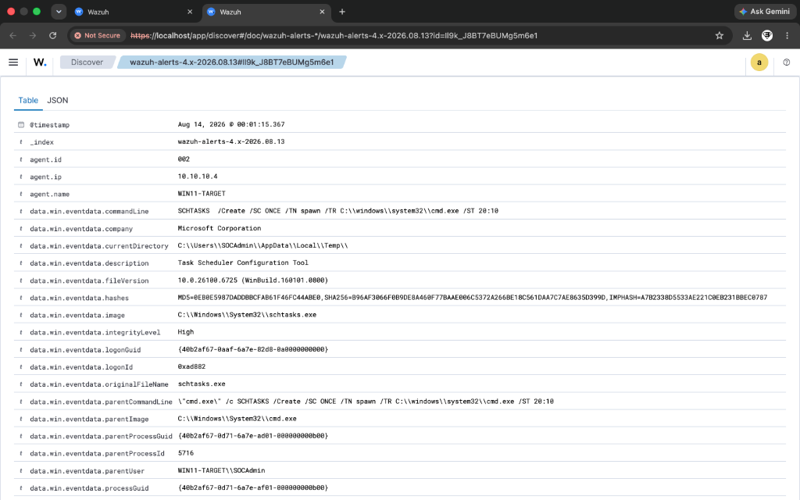

# Incident Report: IR-002
## Technique: Scheduled Task Creation (T1053.005)

### Executive Summary
A high-priority detection alert was triggered on `WIN11-TARGET` following the creation of a new Windows Scheduled Task using `schtasks.exe`. Adversaries establish persistence via Scheduled Tasks to maintain access across reboots and execute payloads at elevated privileges.

---

### 📷 Visual Evidence & Alert Verification


*Figure 2.1: Scheduled Task creation detection (Rule 100101) captured in Wazuh Dashboard.*

---

### Incident Overview
- **Incident ID**: IR-002
- **Severity**: High (Level 12)
- **Target Host**: `WIN11-TARGET` (IP: `10.10.10.4`)
- **Detection Engine**: Wazuh SIEM + Sysmon Integration
- **Custom Rule ID**: `100101`
- **MITRE ATT&CK Mapping**: Persistence / Scheduled Task/Job: Scheduled Task (`T1053.005`)

---

### Threat Details & Execution Vector

#### Attack Command
```cmd
SCHTASKS /Create /SC ONCE /TN spawn /TR C:\Windows\System32\cmd.exe /ST 20:10 /F
```

#### Simulated Behavior
Atomic Red Team (Test #2) simulated an attacker registering an automated task named `spawn` configured to execute `cmd.exe` at a specified time.

---

### Telemetry & Log Evidence

- **Log Source**: `Microsoft-Windows-Sysmon/Operational`
- **Sysmon Event ID**: `1` (Process Create)
- **Image**: `C:\Windows\System32\schtasks.exe`
- **CommandLine**: `SCHTASKS /Create /SC ONCE /TN spawn /TR C:\windows\system32\cmd.exe /ST 20:10`
- **User Context**: `WIN11-TARGET\SOCAdmin`
- **Hashes**: `SHA256=B96AF3066F0B9DE8A460F77BAAE006C5372A266BE18C561DAA7C7AE8635D399D`

---

### Detection Logic & Rule Configuration

Custom Rule `100101` matches `schtasks.exe` invocations containing `/create` switches:

```xml
<rule id="100101" level="12">
  <if_sid>92032</if_sid>
  <field name="win.eventdata.commandLine" type="pcre2">(?i)schtasks.*\/create</field>
  <description>Custom Detection: Scheduled Task Creation via schtasks.exe (Atomic Red Team - T1053.005)</description>
  <mitre>
    <id>T1053.005</id>
  </mitre>
  <group>attack,persistence,custom_detection,</group>
</rule>
```

---

### Response & Containment Recommendations

1. **Task Enumeration**: Query scheduled tasks via PowerShell:
   ```powershell
   Get-ScheduledTask | Where-Object {$_.TaskName -eq "spawn"}
   ```
2. **Task Removal**: Remove the unauthorized persistence entry:
   ```cmd
   schtasks /delete /tn "spawn" /f
   ```
3. **Audit Execution Path**: Inspect binary referenced in `/TR` switch to ensure no malicious executable or script payload remains on disk.
