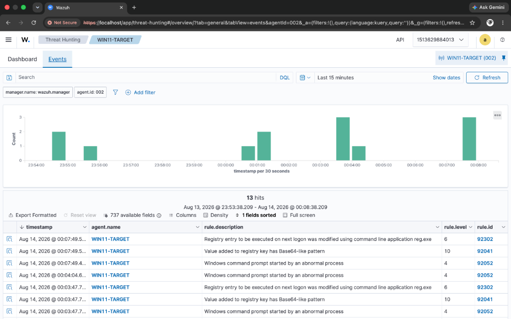

# Incident Report: IR-003
## Technique: Registry Run Keys Persistence (T1547.001)

### Executive Summary
An alert was triggered on `WIN11-TARGET` following a modification to the Windows Registry `CurrentVersion\Run` key. Attackers modify autostart execution registry locations to ensure payloads launch automatically upon system boot or user logon.

---

### 📷 Visual Evidence & Alert Verification


*Figure 3.1: Registry Run Key modification alert (Rule 100102) firing in Wazuh SIEM.*

---

### Incident Overview
- **Incident ID**: IR-003
- **Severity**: High (Level 12)
- **Target Host**: `WIN11-TARGET` (IP: `10.10.10.4`)
- **Detection Engine**: Wazuh SIEM + Sysmon Integration
- **Custom Rule ID**: `100102`
- **MITRE ATT&CK Mapping**: Persistence / Boot or Logon Autostart Execution: Registry Run Keys / Startup Folder (`T1547.001`)

---

### Threat Details & Execution Vector

#### Attack Command
```cmd
reg.exe add HKCU\Software\Microsoft\Windows\CurrentVersion\Run /v "AtomicRedTeam_T1547.001" /t REG_SZ /d "C:\Path\To\File.exe" /f
```

#### Simulated Behavior
Atomic Red Team (T1547.001 Test #1) executed `reg.exe` to inject an autostart registry entry under `HKCU\Software\Microsoft\Windows\CurrentVersion\Run`.

---

### Telemetry & Log Evidence

- **Log Source**: `Microsoft-Windows-Sysmon/Operational`
- **Parent Rule ID**: `92302` (`Registry entry to be executed on next logon was modified using command line application reg.exe`)
- **Process**: `C:\Windows\System32\reg.exe`
- **User Context**: `WIN11-TARGET\SOCAdmin`
- **Target Key**: `HKCU\Software\Microsoft\Windows\CurrentVersion\Run`

---

### Detection Logic & Rule Configuration

Wazuh default rule `92302` detected the initial `reg.exe` autostart modification. Custom Rule `100102` was configured to map the alert directly to MITRE `T1547.001`:

```xml
<rule id="100102" level="12">
  <if_sid>92302</if_sid>
  <description>Custom Detection: Registry Run Key Persistence Modification (Atomic Red Team - T1547.001)</description>
  <mitre>
    <id>T1547.001</id>
  </mitre>
  <group>attack,persistence,custom_detection,</group>
</rule>
```

---

### Response & Containment Recommendations

1. **Query Autostart Keys**: Check autostart entries using PowerShell:
   ```powershell
   Get-ItemProperty -Path "HKCU:\Software\Microsoft\Windows\CurrentVersion\Run"
   ```
2. **Remove Key**: Delete the unauthorized registry persistence key:
   ```cmd
   reg.exe delete HKCU\Software\Microsoft\Windows\CurrentVersion\Run /v "AtomicRedTeam_T1547.001" /f
   ```
3. **Monitor Autostart Locations**: Implement Sysmon Registry Event ID 13 monitoring across all standard autostart hives (`HKLM\...\Run`, `HKLM\...\RunOnce`).
