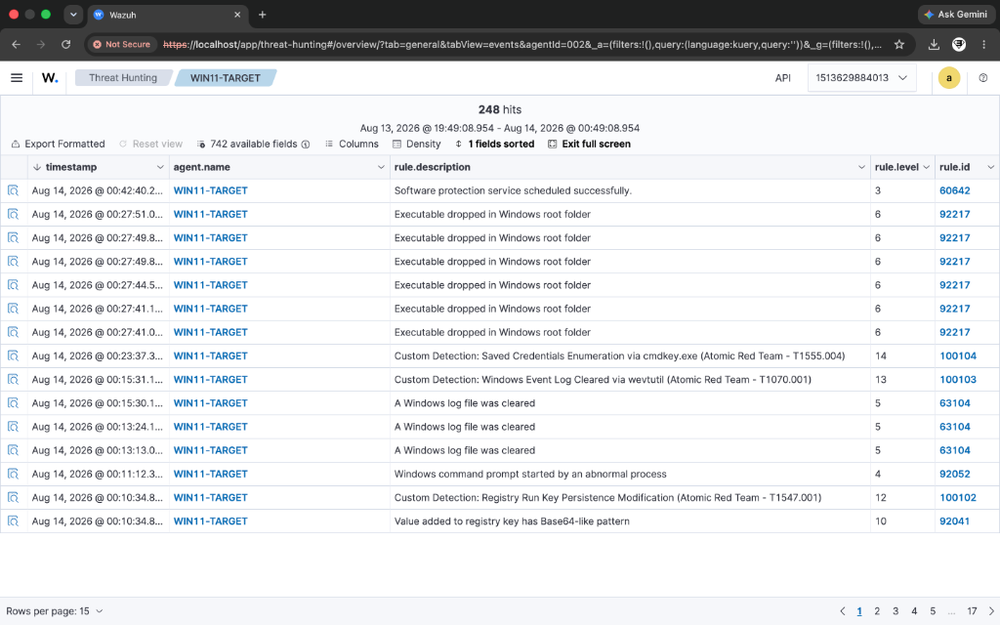

# Incident Report: IR-004
## Technique: Clear Windows Event Logs (T1070.001)

### Executive Summary
A critical defense evasion alert was triggered on `WIN11-TARGET` following the execution of `wevtutil.exe` to clear the Windows System event log channel. Adversaries wipe event logs to cover their tracks, destroy forensic evidence, and hinder post-compromise incident response.

---

### 📷 Visual Evidence & Alert Verification


*Figure 4.1: Event log clearing detection (Rule 100103 Level 13) firing live in Wazuh Threat Hunting.*

---

### Incident Overview
- **Incident ID**: IR-004
- **Severity**: High (Level 13)
- **Target Host**: `WIN11-TARGET` (IP: `10.10.10.4`)
- **Detection Engine**: Wazuh SIEM + Sysmon Integration
- **Custom Rule ID**: `100103` (Standalone Sysmon Rule)
- **MITRE ATT&CK Mapping**: Defense Evasion / Indicator Removal: Clear Windows Event Logs (`T1070.001`)

---

### Threat Details & Execution Vector

#### Attack Command
```cmd
wevtutil cl System
```

#### Simulated Behavior
The attack utilized native Windows Event Utility (`wevtutil.exe`) with the `cl` (clear log) parameter targeting the `System` log channel.

---

### Telemetry & Log Evidence

- **Log Source**: `Microsoft-Windows-Sysmon/Operational`
- **Sysmon Event ID**: `1` (Process Creation)
- **Image**: `C:\Windows\System32\wevtutil.exe`
- **CommandLine**: `wevtutil cl System`
- **Security Event ID 1102**: Triggered when Security log is cleared (`The audit log was cleared`).

---

### Detection Logic & Rule Configuration

Custom Rule `100103` explicitly targets Sysmon Event ID 1 process creation for `wevtutil.exe` with log clearing switches (`cl` or `clear`):

```xml
<rule id="100103" level="13">
  <field name="win.system.providerName">Microsoft-Windows-Sysmon</field>
  <field name="win.system.eventID">1</field>
  <field name="win.eventdata.image" type="pcre2">(?i)\\wevtutil\.exe$</field>
  <field name="win.eventdata.commandLine" type="pcre2">(?i)(\s+cl\s+|\s+clear\s+)</field>
  <description>Custom Detection: Windows Event Log Cleared via wevtutil.exe (T1070.001)</description>
  <mitre>
    <id>T1070.001</id>
  </mitre>
  <group>attack,defense_evasion,custom_detection,standalone,</group>
</rule>
```

---

### Response & Containment Recommendations

1. **Immediate Forensic Triage**: Collect memory dump and disk image before any further anti-forensic commands are executed.
2. **SIEM Retention**: Verify that log telemetry was forwarded off-host to Wazuh prior to log clearing.
3. **Privilege Restructuring**: Restrict administrative accounts capable of executing log deletion commands (`wevtutil`, `Clear-EventLog`).
