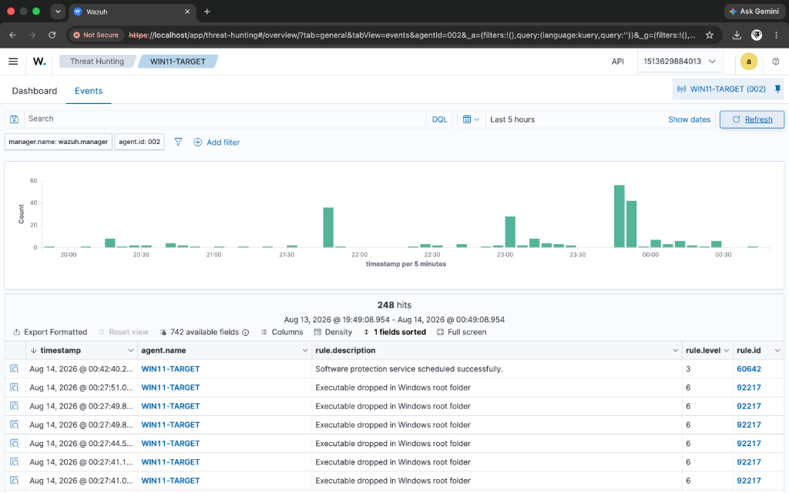

# Incident Report: IR-005
## Technique: Windows Credential Manager Enumeration (T1555.004)

### Executive Summary
A high-severity credential access alert fired on `WIN11-TARGET` following the execution of `cmdkey.exe /list`. Execution of `cmdkey /list` represents a reconnaissance and enumeration signal indicating adversary intent to discover cached credentials, domain tokens, web logins, or network share credentials stored in Windows Credential Manager.

---

### 📷 Visual Evidence & Alert Verification


*Figure 5.1: Windows Credential Manager enumeration detection (Rule 100104) in Wazuh.*

---

### Incident Overview
- **Incident ID**: IR-005
- **Severity**: High (Level 14)
- **Target Host**: `WIN11-TARGET` (IP: `10.10.10.4`)
- **Detection Engine**: Wazuh SIEM + Sysmon Integration
- **Custom Rule ID**: `100104` (Standalone Sysmon Field Match)
- **MITRE ATT&CK Mapping**: Credential Access / Credentials from Password Stores: Windows Credential Manager (`T1555.004`)

---

### Threat Details & Execution Vector

#### Attack Command
```cmd
cmdkey.exe /list
```

#### Technical Analysis
The execution of native `cmdkey.exe` with the `/list` parameter queries the local Windows Credential Manager store. While `/list` displays stored target names and usernames, it serves as an initial discovery phase prior to password extraction or privilege escalation attempts.

---

### Telemetry & Log Evidence

- **Log Source**: `Microsoft-Windows-Sysmon/Operational`
- **Sysmon Event ID**: `1` (Process Creation)
- **Image**: `C:\Windows\System32\cmdkey.exe`
- **CommandLine**: `cmdkey.exe /list`
- **User Context**: `WIN11-TARGET\SOCAdmin`

---

### Detection Logic & Rule Configuration

Custom Rule `100104` explicitly scopes to Sysmon Event ID 1 process creation for `cmdkey.exe` with `/list` arguments:

```xml
<rule id="100104" level="14">
  <field name="win.system.providerName">Microsoft-Windows-Sysmon</field>
  <field name="win.system.eventID">1</field>
  <field name="win.eventdata.image" type="pcre2">(?i)\\cmdkey\.exe$</field>
  <field name="win.eventdata.commandLine" type="pcre2">(?i)\/list</field>
  <description>Custom Detection: Saved Credentials Enumeration via cmdkey.exe (T1555.004)</description>
  <mitre>
    <id>T1555.004</id>
  </mitre>
  <group>attack,credential_access,custom_detection,standalone,</group>
</rule>
```

---

### Response & Containment Recommendations

1. **Investigate Scope**: Determine if the execution was accompanied by credential dump tools, LSASS access, or secondary privilege escalation commands.
2. **Targeted Credential Rotation**: Evaluate credentials saved on the host and rotate secrets for accounts identified in the active incident window based on investigation findings.
3. **LAPS & GPO Hardening**: Enforce Windows Local Administrator Password Solution (LAPS) and enforce GPOs to prevent persistent domain credential caching where unneeded.
